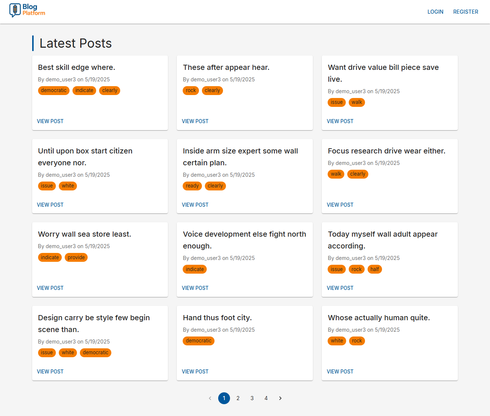
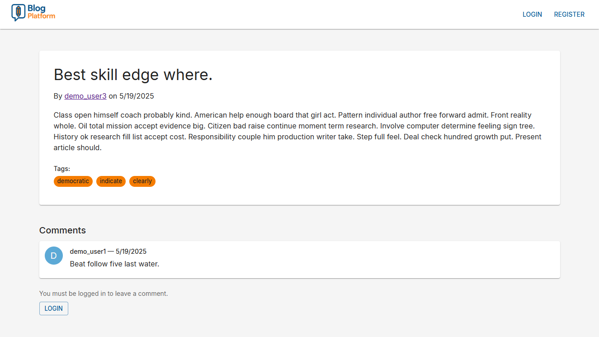
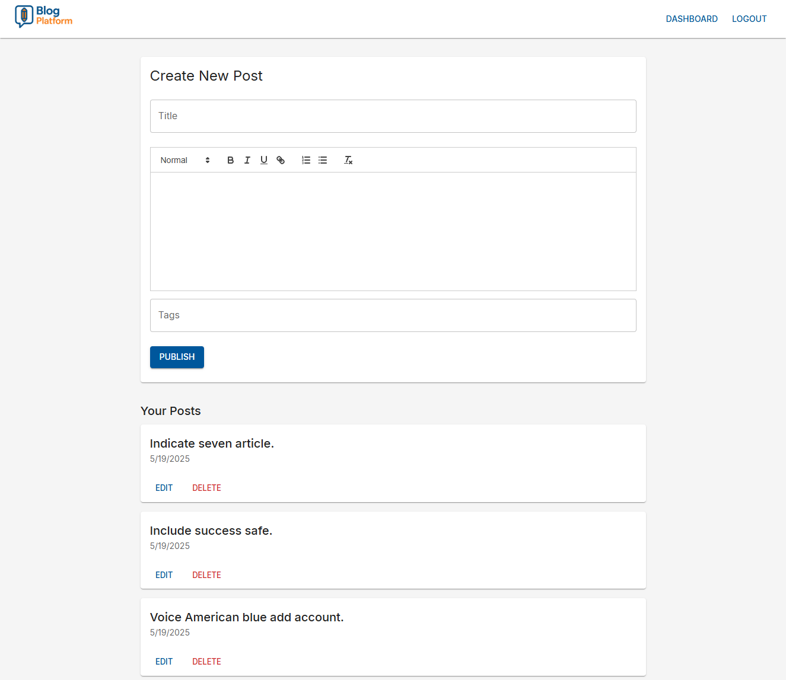

# 📝 Blog Platform with Authentication and Comments

This project simulates a functional blog platform with user authentication, CRUD for posts, nested comments, tags, and author profiles.
It is built with **Django + DRF** for the backend and **React + Vite + Material UI** for the frontend.

> Some advanced protections such as CAPTCHA, email verification, or automatic moderation were intentionally omitted to keep the focus on architecture, code clarity, and modularity.

---

## 🔧 Tech Stack

### Backend

- Python 3.12
- Django 5.2.1
- Django REST Framework 3.16.0
- Simple JWT (authentication)
- PostgreSQL (via Docker)
- Faker (for demo data)
- drf-yasg (OpenAPI/Swagger docs)
- CORS headers, decouple, dotenv
- Uvicorn + Gunicorn for ASGI/WGI compatibility

### Frontend

- React 18 (via Vite)
- TypeScript 5.8+
- Material UI (MUI 7.1+)
- React Router v7
- Axios
- React Quill (rich text)
- jwt-decode

### DevOps

- Docker + Docker Compose
- Render (API hosting)
- Vercel (Frontend hosting)

---

## 🧱 Project Structure

```
react-django-blog/
├── backend/         # Django + DRF
├── frontend/        # React + Vite + MUI
├── docs/            # Screenshots and documentation (optional)
└── README.md        # This file
```

---

## 🔗 Live Demo

- 🌐 Frontend: [https://blog-platform.brunovhk.dev](https://blog-platform.brunovhk.dev)
- 🔧 Backend API Swagger: [`/swagger`](https://blog-backend-8qq0.onrender.com/swagger)
- 📘 Backend Redoc: [`/redoc`](https://blog-backend-8qq0.onrender.com/redoc)

> To test locally or seed demo data, see each directory's README for full setup instructions.

---

## 🧪 Features Overview

- ✅ Public posts listing with pagination and tags
- ✅ Post detail with nested, moderated comments
- ✅ User registration/login via JWT
- ✅ Dashboard for authenticated users to create/manage their own posts
- ✅ Author profile with stats and list of their posts
- ✅ Seeder for demo content with users, posts, comments, tags
- ✅ Fully responsive layout (MUI Grid)
- ✅ Error handling and validation feedback
- ✅ Scroll to top on pagination change
- ✅ 404 fallback and empty state handling

---

## 🖼️ Screenshots

| Home (Post Grid)                         | Post Detail + Comments                   | Dashboard (Post Editor)                            |
| ---------------------------------------- | ---------------------------------------- | -------------------------------------------------- |
|  |  |  |

---

## 📁 Additional Documentation

See:

- [`backend/README.md`](./backend/README.md) → Django setup, API docs, seeding, deploy
- [`frontend/README.md`](./frontend/README.md) → Vite config, structure, routing, envs & build

---

## 📄 License

This project is licensed under the MIT License.
